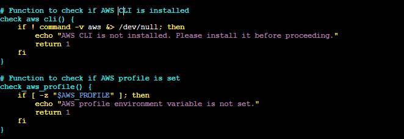
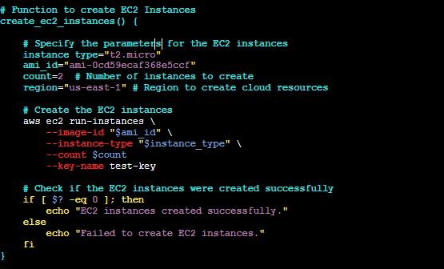

# CAPSTONE PROJECT: SHELL SCRIPT FOR AWS IAM MANAGEMENT

Datawise Solutions requires efficient management of AWS Identity and Access Management (IAM) resources. The company is expanding its team and needs to onboard five new employess to access AWS resources securely.

## Objectives
### Script enhancement: Extend the provided script to include IAM management

#### The provided script

1

### To store the names of five IAM users in an array and create those users using AWS CLI in a shell script, follow these steps:

1. Store the user names in an array
In shell scripting, you can define an array and iterate over it using a loop.

2. Use the AWS CLI create-user command to create IAM users.

## Explanation:

Array Definition: The array IAM_USERS holds the five IAM usernames.

Loop: The for loop iterates over each user in the array.

AWS CLI Command: The aws iam create-user --user-name "$user" command creates the IAM user.

Error Handling: After each command, the script checks if the previous command executed successfully using $?. If the user is created, it prints a success message; otherwise, it prints an error message.

Requirements:
Ensure the AWS CLI is installed and configured with the necessary permissions to create IAM users (aws configure).

### Create  IAM group, attach Adninistrative policy and assign IAM users to the group

### Explanation:

Function Definition: create_iam_group_and_assign_users is defined to handle the creation of an IAM group, attachment of a policy, and addition of users.

Group and Users:
GROUP_NAME is set to "Admin_Group".

USERS is an array containing the names "Tope", "Tolani", and "Craig".
Create IAM Group:

The aws iam create-group command creates the IAM group with the specified name. If this fails, an error message is displayed and the script exits.

Attach Policy: The aws iam attach-group-policy command attaches the AdministratorAccess policy to the group. If this fails, an error message is displayed and the script exits.

Add Users to Group:  The script iterates over the USERS array and uses the aws iam add-user-to-group command to add each user to the group. If adding any user fails, an error message is displayed and the script exits.
Call the Function:

The function create_iam_group_and_assign_users is called to execute the operations defined.

Prerequisites:

Ensure AWS CLI is installed and configured with sufficient permissions to create IAM groups, attach policies, and manage IAM users.

The users Tope, Tolani, and Craig must already exist. If they do not, you should create them before running this script or modify the script to include user creation as well.

This script automates the creation of an IAM group, attaches a policy to it, and manages user assignments, which can be particularly useful for setting up permissions and access control in AWS.

